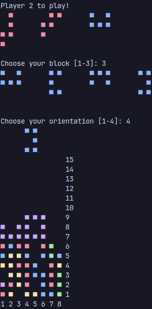

# Octis

This game is based on **Tetris** but this time as a 2-player game where the goal is to make the oppponent place a block over the limit. 
 
This version of the game is written entirely in C and using SDL2 for graphics. The program was tested by Valgrind to detect any memory leaks and none were reported. 
This same game is also written in [Python](https://github.com/K0LALA/OctisTerminal) but has less features. 

<!---->

You are free to use the entirety of the idea and the code as you wish as this was made for eductional purposes.
