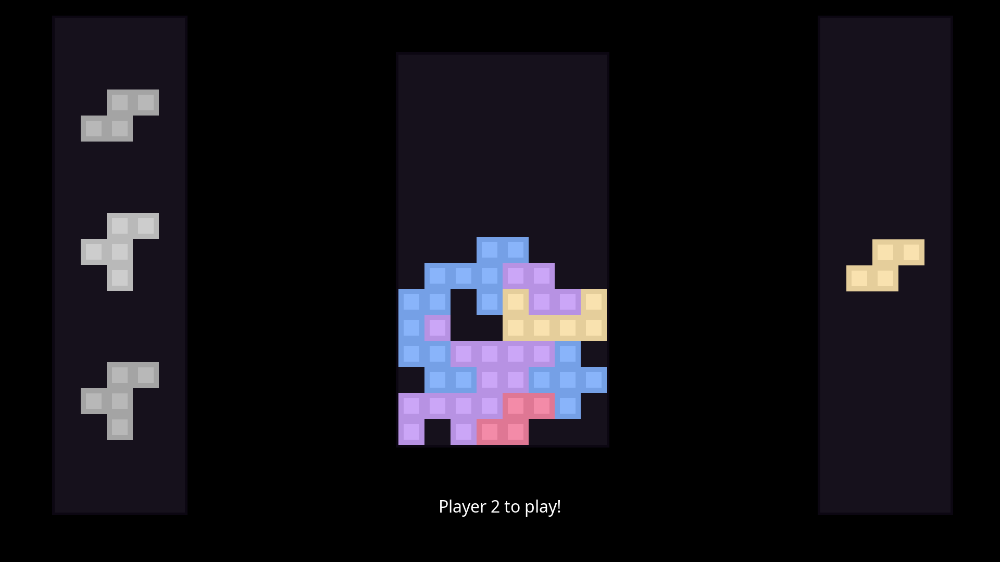

# Octis

This game is based on **Tetris** but this time as a 2-player game where the goal is to make the oppponent place a block over the limit. 
 
This version of the game is written entirely in C and using SDL2 for graphics. 
This same game is also written in [Python](https://github.com/K0LALA/OctisTerminal) but has less features. 

## Building

In order to build the program, you first need to install the SDL2 and SLD2_ttf libraries which you can find online. 
Then using GCC, or the compiler of your choice: 
`gcc -o octis.out octis.c screen.c $(sdl2-config --cflags --static-libs) /path/to/libSDL2_ttf.a` 
 
If you want to create a Windows executable from Linux, you can refer to this <a href="https://gist.github.com/CobaltXII/f6f49dd3217569b20879a5e059953544">link</a>.
With a command that may look like this: 
`x86_64-w64-mingw32-gcc -o octis.exe octis.c screen.c $(x86_64-w64-mingw32-pkg-config sdl2 --cflags --static-libs) /path/to/libSDL2_ttf.dll` 
 

## License

You are free to use the entirety of the idea and the code as you wish as this was made for eductional purposes.
